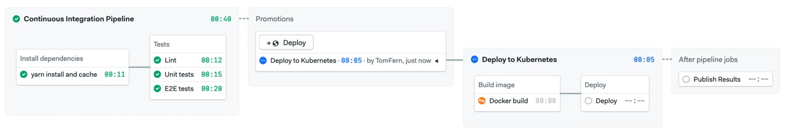

# Semaphore demo CI/CD pipeline using Node.js and Kubernetes

Example application and CI/CD pipeline showing how to run a Node.js project on Semaphore.

The application is based on Nest.js. The code is written in TypeScript.

The application can be deployed to any Kubernetes cluster.

## CI/CD on Semaphore

1. Setup you database. Check `ormconfig.json` for details.
2. Download the [kubeconfig](https://kubernetes.io/docs/concepts/configuration/organize-cluster-access-kubeconfig/) file and upload it as a [secret](https://docs.semaphoreci.com/essentials/using-secrets/) on Semaphore.
3. Fork this fork and add it to Semaphore.
4. Push a change to your repository and deploy the application.

The CI pipeline will look like this:



The example pipeline contains 2 blocks:

- Build
    - Install Dependencies: installs and caches all npm dependencies
- Test
    - Lint: Runs tslint to check project files codestyle
    - Unit tests: Runs Unit Tests
    - E2E tests: Runs E2E tests through jest on server.

Then, if all checks are ok, we move to build pipeline. It consists of one block

 - Build: build the container image and push to the [ttl.sh](https://ttl.sh/) public repository .
 - Deploy: deploy the image in your Kubernetes cluster.

## Local project setup

This project requires a PostgreSQL database. If you don't have one you can launch a Docker container to have one.

### Configuration

Copy sample files:

```bash
$ cp .sample.env .env
```

Launch db:

```bash
$ docker-compose up
```

### Configure and launch app

Install dependencies:

```bash
$ yarn install
```

Copy app and db config:

```bash
$ cp sample.env .env
$ cp ormconfig.sample.json ormconfig.json
```

Run migrations:

```bash
# apply migrations forward
$ yarn run migrate:up

# to revert last migration
$ yarn run migrate:revert
```

Running the app:

```bash
# development mode
$ yarn run start

# watch mode
$ yarn run start:dev

# production mode
$ yarn run start:prod
```

Run static code analysis:

```bash
$ yarn run lint
```

Run unit and end-to-end tests:

```bash
# unit tests
$ yarn run test

# e2e tests
$ yarn run test:e2e

# test coverage
$ yarn run test:cov
```

## Deploy configuration

Check out `.semaphore/` folder - steps described there have helpful comments to help you figure out what commands are doing.
Also check out `.semaphore/secrets` folder. To configure deploy you need to create and populate all those secrets.
Copy each secret file into file without `.sample` in filename and populate it. All of them have useful description comments to help you out.

## License

Copyright (c) 2022 Rendered Text

Distributed under the MIT License. See the file [LICENSE.md](./LICENSE.md).
