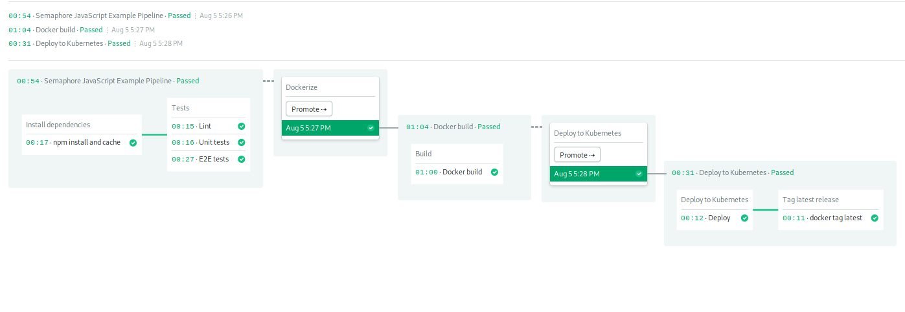

# Semaphore demo CI/CD pipeline using Node.js and Kubernetes

Example application and CI/CD pipeline showing how to run a Node.js project
on Semaphore 2.0. 

The application is based on Nest.js. The code is written in TypeScript.

The application is deployed to Google Cloud Kubernetes.

## CI/CD on Semaphore

1. Fork this repository and use it to 
[create a project](https://docs.semaphoreci.com/article/63-your-first-project).
2. Create a project on Google Cloud: `semaphore-demo-nodejs-k8s`
3. Create Kubernetes cluster on Google Cloud: `semaphore-demo-nodejs-k8s-server`
4. Create PostgreSQL db on Google Cloud.
5. Create database `demo` and user `demouser`.
6. Copy environment files and edit db hostname and db password:
    ```bash
    $ cp ormconfig.sample.json /tmp/ormconfig.production.json
    $ cp sample.env /tmp/production.env
    ```
7. Upload environment files as a secret:

    ```bash
    $ sem create secret production-env \
        -f /tmp/ormconfig.production.json:/home/semaphore/ormconfig.production.json \
        -f /tmp/production.env:/home/semaphore/production.env
    ```

8. Create Service Account in IAM:
    - Role: project owner
    - Create and download access key JSON file.
9. Upload Access Key to Semaphore as a secret:
    ```bash
    $ sem create secret gcr-secret \
        -e GCP_PROJECT_ID=semaphore-demo-nodejs-k8s \
        -e GCP_PROJECT_DEFAULT_ZONE=YOUR_REGION_AND_ZONE \
        -f PATH_TO_YOUR_ACCESS_KEY_FILE.json:/home/semaphore/.secrets.gcp.json 
    ```
10. Push changes to get workflow started.

The CI pipeline will look like this:



The example pipeline contains 2 blocks:

- Build
 - Install Dependencies: installs and caches all npm dependencies
- Test
 - Lint: Runs tslint to check project files codestyle
 - Unit tests: Runs Unit Tests
 - E2E tests: Runs E2E tests through jest on server.

Then, if all checks are ok, we move to build pipeline. It consists of one block

 - Build: build container and push it into google repository

Then, after we've built our apps we move to deploy pipeline.
It  also consists of one block for client and of two for server.
As you can see deploy pipelines of client and server depend only on their own build step
and therefore could be run in parallel.

 - Deploy
    - Deploy server to k8s, pdate k8s deployment using deployment config
    - Tag container if all went well

## Local project setup

This project requires a PostgreSQL database. If you don't have one you can
launch a Docker container to have one.

### Configuration

Copy sample files:

```bash
$ cp .sample.env .env
```

Launch db:

```bash
$ docker-compose up
```

### Configure and launch app

Install dependencies:

```bash
$ npm install
```

Copy app and db config:

```bash
$ cp sample.env .env
$ cp ormconfig.sample.json ormconfig.json
```

Run migrations:

```bash
# apply migrations forward
$ npm run migrate:up

# to revert last migration
$ npm run migrate:revert
```

Running the app:

```bash
# development mode
$ npm run start

# watch mode
$ npm run start:dev

# production mode
$ npm run start:prod
```

Run static code analysis:

```bash
$ npm run lint
```

Run unit and end-to-end tests:

```bash
# unit tests
$ npm run test

# e2e tests
$ npm run test:e2e

# test coverage
$ npm run test:cov
```

## Deploy configuration

Check out `.semaphore/` folder - steps described there have helpful comments to help you figure out what commands are doing.
Also check out `.semaphore/secrets` folder. To configure deploy you need to create and populate all those secrets.
Copy each secret file into file without `.sample` in filename and populate it. All of them have useful description comments to help you out.

## License

Copyright (c) 2019 Rendered Text

Distributed under the MIT License. See the file [LICENSE.md](./LICENSE.md).
